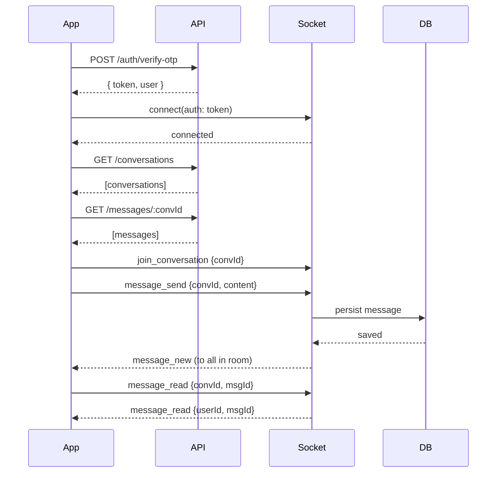

# @architecture — Liora Integration Plan

This document describes the current backend state and how it will integrate with the Flutter front‑end. It also lists the APIs, Socket.IO contracts, data shapes, and a pragmatic rollout plan.

## 1) High‑level overview
- Frontend (Flutter): `liora_flutter/`
  - Auth (phone), messages list, chat screen, media sharing, providers via Riverpod, navigation via GoRouter
- Backend (Node.js/Express): `liora_backend/`
  - REST APIs (auth ready; conversations/messages routes referenced but not yet implemented)
  - MongoDB (users, conversations, messages)
  - Redis (OTP + future presence/ratelimiting)
  - Socket.IO (real‑time messaging; handler referenced but not yet implemented)

### Runtime flow (condensed)
1. User completes phone auth (Firebase). App obtains a JWT from backend using verified phone number (optional if you keep Firebase‑only auth; plan below supports either).
2. App calls REST to fetch user, conversations, latest messages.
3. App opens a Socket.IO connection with JWT auth.
4. Messages are sent via sockets; server persists to Mongo, updates conversation state, emits events to peers.
5. Read receipts, typing indicators, and presence are propagated via sockets; counters and lastRead are updated.

## 2) Backend current state (as of repo)
- `src/server.js`: Express app with security middleware, CORS, rate‑limits, JSON body parsing; Socket.IO server created and `setupSocketIO(io)` expected, but file missing.
- `src/routes/auth.js`: OTP via Redis, SMS sending abstraction, user creation/update, returns JWT.
- Models:
  - `User`: phone‑centric, optional email/username, online/lastSeen, device tokens, settings
  - `Conversation`: direct/group/channel, members array with roles, lastMessage, unread tracking, settings
  - `Message`: conversation, sender, type (text/media/file/system), reactions, read/delivered, soft delete, TTL for disappearing messages
- Missing (referenced by `server.js`):
  - `src/socket/socketHandler.js`
  - `src/routes/userRoutes.js`
  - `src/routes/conversationRoutes.js`
  - `src/routes/messageRoutes.js`

## 3) Data contracts (backend ⇄ frontend)
### 3.1 User (public subset)
```json
{
  "id": "string",
  "phoneNumber": "+15555550123",
  "username": "user_123",
  "displayName": "Alice",
  "avatarUrl": "https://...",
  "isPhoneVerified": true,
  "isOnline": true,
  "lastSeen": "2025-09-07T03:10:00.000Z"
}
```

### 3.2 Conversation (list item)
```json
{
  "id": "string",
  "type": "direct|group|channel",
  "name": "Study Group",
  "avatarUrl": "https://...",
  "members": [ { "user": {"id":"...","username":"...","displayName":"...","avatarUrl":"...","isOnline":true}, "role":"member", "unreadCount": 2 } ],
  "lastMessage": { "id": "...", "type": "text", "content": {"text":"Hello"}, "sender": {"id":"...","displayName":"Alice"}, "createdAt": "..." },
  "lastActivity": "2025-09-07T03:10:00.000Z",
  "isArchived": false
}
```

### 3.3 Message
```json
{
  "id": "string",
  "conversation": "convId",
  "sender": { "id":"userId", "displayName":"Alice", "avatarUrl":"..." },
  "type": "text|image|video|audio|file|system",
  "content": { "text": "Hi" },
  "replyTo": { "id":"msgId", "content": {"text":"..."}, "sender": {"id":"..."} },
  "reactions": [ { "emoji":"👍", "count": 2, "users":["userId"] } ],
  "readBy": [ { "user":"userId", "readAt":"..." } ],
  "deliveredTo": [ { "user":"userId", "deliveredAt":"..." } ],
  "createdAt": "...",
  "editedAt": null,
  "isDeleted": false
}
```

## 4) REST API surface
Base: `/api`

### 4.1 Auth (existing)
- `POST /auth/send-otp` { phoneNumber }
- `POST /auth/verify-otp` { phoneNumber, otp } → { token, user }
- `GET /auth/me` → current user (requires `Authorization: Bearer <jwt>`)
- `POST /auth/update-profile` → set `displayName|username|avatarUrl`

### 4.2 Conversations (to be added)
- `GET /conversations?limit&skip` → list conversations for current user
- `POST /conversations` { type, name?, memberIds[] } → create (direct requires 2 members)
- `GET /conversations/:id` → details, member list
- `POST /conversations/:id/members` { userId } → add member
- `DELETE /conversations/:id/members/:userId` → remove member
- `PATCH /conversations/:id` { name?, description?, settings? } → update

### 4.3 Messages (to be added)
- `GET /messages/:conversationId?limit&before` → paginated history
- `POST /messages/:conversationId` { type, content } → send (for non‑realtime fallback)
- `POST /messages/:conversationId/read` { lastReadMessageId } → mark as read
- `POST /messages/:conversationId/react` { messageId, emoji } → add/remove reaction

## 5) Socket.IO contracts
Namespace: `/` (default). Client connects with `auth: { token }`.

### 5.1 Connection
- server: validates JWT, joins a user room `user:<userId>` for direct signaling
- optional: update `isOnline` and `lastSeen`

### 5.2 Rooms
- Conversation room name: `conv:<conversationId>`
- `join_conversation` { conversationId }
- `leave_conversation` { conversationId }

### 5.3 Messaging
- `message_send` { conversationId, type, content, clientId }
  - server persists → emits `message_new` to `conv:<id>` with saved message
  - server also updates `conversation.lastMessage`, increments unread for other members
- `message_edit` { messageId, content }
- `message_delete` { messageId }
- `message_read` { conversationId, messageId }
  - emits `message_read` with { userId, messageId }
- `typing` { conversationId, isTyping }
  - emits `typing` to `conv:<id>` with { userId, isTyping }

### 5.4 Delivery receipts (optional v1)
- On emission to peers, server also emits `message_delivered` to sender when all sockets in conv acknowledge.

### 5.5 Error events
- `error_generic` { code, message }

## 6) Frontend integration map

| Flutter Screen/Widget | Actions | REST | Socket |
| - | - | - | - |
| `phone_input_screen.dart` | Request OTP | `POST /auth/send-otp` | — |
| `otp_verification_screen.dart` | Verify OTP, get JWT | `POST /auth/verify-otp` | — |
| Profile setup (auth flow) | Update profile | `POST /auth/update-profile` | — |
| `messages_screen.dart` / `features/chat/enhanced_messages_screen.dart` | List conversations | `GET /conversations` | Connect socket after token |
| `chat_screen.dart` / `features/chat/enhanced_chat_screen.dart` | Load history, send/receive messages, receipts, typing | `GET /messages/:conversationId` | `join_conversation`, `message_send`, `message_new`, `message_read`, `typing` |
| Media sending widgets | Upload to storage (e.g., Cloudinary/S3), send media message | (Upload endpoint if backend manages uploads; or client uploads then posts URL) | `message_send` with `content.media` |

## 7) Auth strategy
- Keep Firebase for phone verification in the app.
- Use backend JWT for API + socket auth (issued in `/auth/verify-otp`).
- Mobile app sends `Authorization: Bearer <jwt>` for REST and `io(auth: {token})` for Socket.IO.

## 8) Presence & unread counts
- Presence: on socket connect → set `isOnline=true`, on disconnect → set `lastSeen`.
- Unread: when saving a new message → `conversation.incrementUnreadCount(senderId)`. When user sends `message_read` → set `lastReadMessageId` and recompute unread (or set to 0 for that member).

## 9) Environment/config
- `MONGODB_URI`, `REDIS_URL`, `JWT_SECRET`, `CORS_ORIGIN`, `PORT`
- SMS provider keys if using real OTP (Twilio, etc.)

## 10) Rollout plan (incremental)
1. Implement missing files referenced by `server.js`:
   - `src/socket/socketHandler.js` with auth + events above
   - `src/routes/conversationRoutes.js`
   - `src/routes/messageRoutes.js`
   - (optional) `src/routes/userRoutes.js` for search and presence
2. Wire middleware:
   - `protect` (JWT) on all chat routes, optional on search
3. Frontend wiring:
   - After `/auth/verify-otp`, store JWT (secure storage)
   - Initialize socket with token; join conversation on chat open
   - Show typing, receipts, unread counters
4. Observability & safety:
   - Add basic request logging, socket event logging
   - Validate payloads server‑side
   - Backoff/retry for socket reconnection
5. Media:
   - Decide on direct upload (client→cloud) vs. backend proxy; include signed URLs if needed

## 11) Diagrams (frontend path excerpt)
Mermaid source exists at `liora_flutter/architecture`. Consider adding a second diagram for sockets:



---
This plan keeps v1 focused: secure auth, reliable storage, and a minimal real‑time layer that maps cleanly to your existing Flutter screens.

